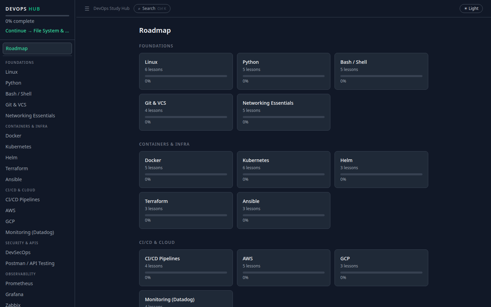

# DevOps Study Hub

An interactive, self-hosted learning tool for anyone transitioning into DevOps or SRE. Covers 23 topics, 91 structured lessons, 455 quiz questions, and 184 interview questions — all running locally on your machine.



---

## Contents

- [What's inside](#whats-inside)
- [Prerequisites](#prerequisites)
- [Quick start](#quick-start)
- [Database](#database)
- [Run options](#run-options)
- [AI features](#ai-features)
- [Environment variables](#environment-variables)
- [Security note](#security-note)
- [Contributing](#contributing)
- [License](#license)

---

## What's inside

| Area | Topics |
|---|---|
| **Foundations** | Linux, Python, Bash/Shell, Git & VCS, Networking |
| **Containers & Infra** | Docker, Kubernetes, Helm, Terraform, Ansible |
| **CI/CD & Cloud** | GitHub Actions, Jenkins, ArgoCD, AWS, GCP |
| **Security & APIs** | DevSecOps, Postman / API Testing |
| **Observability** | Prometheus, Grafana, Zabbix, Elasticsearch, Logstash, Kibana, Opsgenie |

**By the numbers:** 91 lessons · 455 quiz questions · 184 interview questions · 10 multi-step projects

**Key features:**
- AI Tutor with streaming answers, scoped to the current lesson
- Code Sandbox — write and run Bash, Python, and YAML inline with real subprocess execution
- Spaced repetition quizzes (SM-2 algorithm) with weak-area drill across all modules
- Interview Prep — AI grades answers Weak / Adequate / Strong; flashcard mode for self-grading
- 10 interview-ready projects (Kubernetes, IaC, GitOps, Helm, ELK, and more)
- Roadmap with per-module readiness scores, XP, streaks, and progress export
- Per-module command reference cards for quick lookup mid-lesson

All study data stays local. No account or subscription required.

---

## Prerequisites

| Tool | Minimum version | Notes |
|---|---|---|
| Python | 3.12+ | Used for the FastAPI backend |
| Node.js | 18+ | Used for the React frontend |
| npm | 9+ | Comes with Node 18+ |
| Git | any | For cloning the repo |

**Supported OS:** Linux and macOS. Windows is not currently supported (WSL2 may work but is untested).

Optional: Docker 24+ if you prefer the containerized setup.

### macOS notes

- Install Python and Node via Homebrew: `brew install python@3.12 node`
- **Bash sandbox exercises:** macOS ships bash 3.2 (Apple won't update past GPL v2). Exercises that use bash 4+ features (`declare -A`, `mapfile`, `${var,,}`) will fail in the sandbox. Two options:
  - **Recommended:** use Docker — the container runs Linux with bash 5.x, so all exercises work correctly
  - **Alternative:** `brew install bash` — the sandbox PATH includes `/opt/homebrew/bin`, so Homebrew bash 5.x is picked up automatically on Apple Silicon and Intel Macs

---

## Quick start

```bash
# 1. Clone
git clone https://github.com/igalhub/devops-study-hub.git
cd devops-study-hub

# 2. Backend
python3 -m venv .venv
.venv/bin/pip install -r backend/requirements.txt

# 3. API key (required for AI features — see AI features section)
cp backend/.env.example backend/.env
# Open backend/.env and set: ANTHROPIC_API_KEY=sk-ant-...

# 4. Frontend
cd frontend && npm install && cd ..

# 5. Run
./start.sh
```

Opens http://localhost:5173 automatically. Ctrl-C stops both servers.

**After `git pull`:** the seed scripts (`seed.py`, `seed_curriculum.py`, `seed_interview.py`, `seed_projects.py`) are all idempotent — safe to re-run on an existing database without data loss. Schema migrations are not currently needed; `db.py` creates missing tables on startup.

---

## Database

The repo ships with a pre-seeded `backend/hub.db` containing all 455 quiz questions, 184 interview questions, and 10 projects — ready on first launch, no extra seeding step required. Your study progress is stored in the same file and stays local.

**For contributors:** run this once after cloning so local progress changes don't appear as pending commits:

```bash
git update-index --skip-worktree backend/hub.db
```

**Limitation:** this flag doesn't survive `git checkout` or `git stash` — you'll need to re-run it after switching branches or unstashing. To back up your progress before a branch switch, use the Export button on the Stats page.

To reset back to a clean pre-seeded state at any time:

```bash
cd backend && ../.venv/bin/python reset_progress.py --yes
```

---

## Run options

**Option A — single terminal (recommended):**

```bash
./start.sh
```

Starts backend (port 8000) and frontend (port 5173), opens browser automatically, and monitors both processes. Ctrl-C stops everything cleanly.

**Option B — two terminals:**

```bash
# Terminal 1 — backend
./start-backend.sh

# Terminal 2 — frontend
./start-frontend.sh
```

**Option C — Docker:**

```bash
docker compose up --build
```

Frontend at http://localhost:5173, backend at http://localhost:8000. The API key is read from `backend/.env` at runtime (never baked into the image).

---

## AI features

AI features require an [Anthropic API key](https://console.anthropic.com/). Usage is pay-per-use — typical study sessions cost a few cents.

| Feature | What it does |
|---|---|
| AI Tutor | Streams answers scoped to the current lesson |
| Interview grader | Scores your answer Weak / Adequate / Strong with written feedback |
| Show answer | Generates a full solution for open-ended exercises |

**Without an API key:** lessons, quizzes, projects, and reference cards all work. AI Tutor, interview grading, and Show Answer will return an error when called.

---

## Environment variables

| Variable | Required | Default | Description |
|---|---|---|---|
| `ANTHROPIC_API_KEY` | Yes (for AI) | — | Anthropic API key |
| `CLAUDE_MODEL` | No | `claude-sonnet-4-6` | Claude model to use |
| `VITE_API_URL` | No | `http://localhost:8000` | Backend URL (override in `frontend/.env`) |

---

## Security note

The Code Sandbox executes real subprocess calls on your machine with resource limits (CPU, memory, file size, open file descriptors) and a stripped environment. This is intentional for a self-hosted learning tool, but it means **you should not expose this app to the public internet** without additional hardening (network isolation, container isolation, seccomp profiles).

Run it on `localhost` only, which is the default.

---

## Contributing

Contributions are welcome — new lessons, quiz questions, bug fixes, or sandbox improvements. See [CONTRIBUTING.md](CONTRIBUTING.md) for details.

---

## License

[MIT](LICENSE) — free to use, modify, and distribute.

---

*Built by [Igal](https://github.com/igalhub) as part of a DevOps career transition.*
